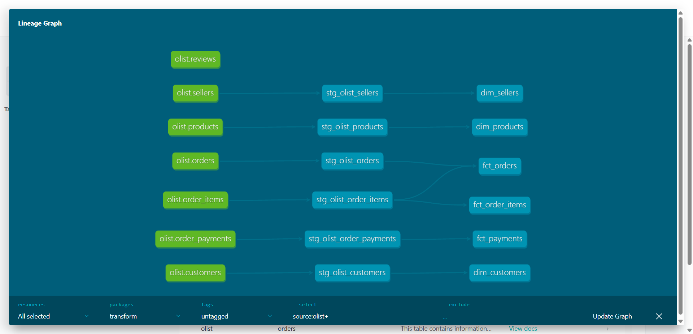
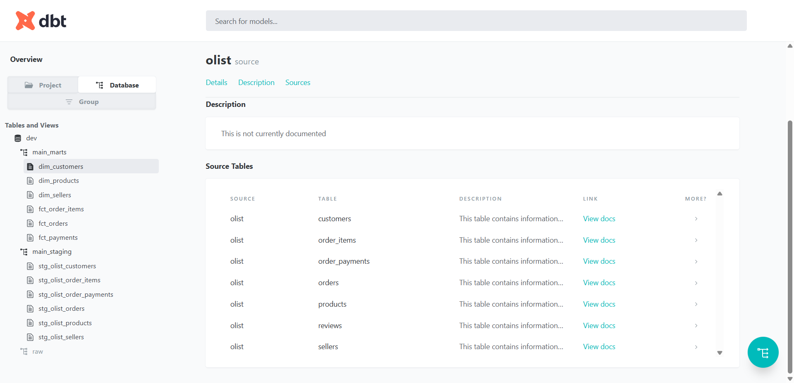
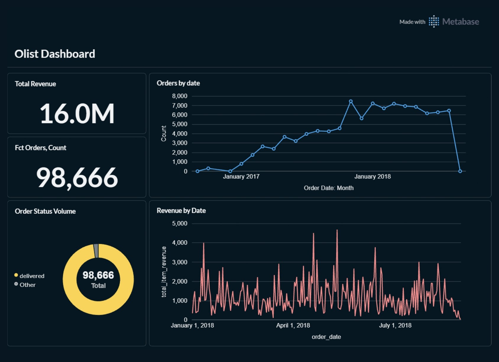

# Beginner Analytics Engineering Project 1
## The Olist Data Project

Welcome to the first beginner project for analytics engineering. This project designed to introduce beginners to creating a transformation pipeline using dbt and duckdb.

This project demonstrats building a simple pipelinw that
- transforms data from source (duckdb)
    
- models staging and mart layers (using dbt)
    
- creates clear project documentation
    

This projects walks through:
- dbt models
- dbt test
- dbt docs
- configuring your dbt project
- ingesting CSV into a data warehouse
- transforming your data
- creating your models
- and creating your BI consumption layer

The final layer is the BI Layer which consumes the data models from the data warehouse (using metabase)
the final layer:
